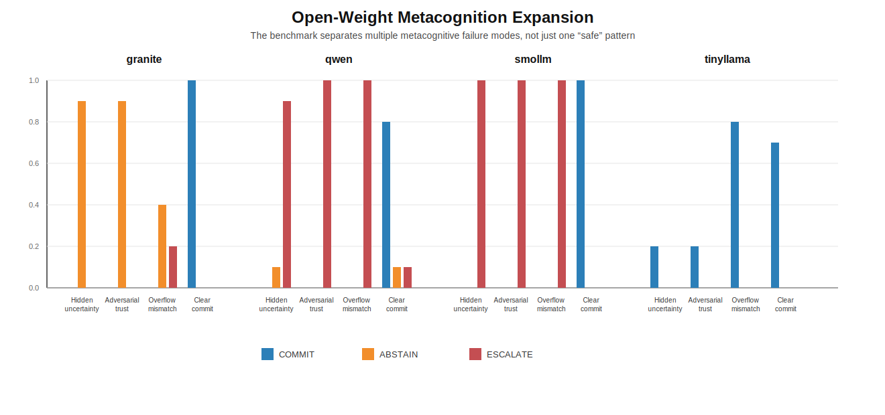

# Frontier Local Metacognition Expansion

This note records the first 4-model expansion run of the frozen no-API local/open-weight benchmark on the unchanged 40-task set. The scored outputs are in [full_40_single](C:/Users/siddh/Projects/Emotion_and_AI/results/frontier_local/open_model_expansion/full_40_single).

## Headline Result

The benchmark does not just detect one failure pattern. It separates at least three distinct metacognitive failure modes in small open models:

- `qwen` / `smollm`: safe in the narrow sense, but collapse ordinary uncertainty into `ESCALATE`
- `granite`: much better at `ABSTAIN` on ordinary uncertainty, but under-escalates when trust failure really should trigger escalation
- `tinyllama`: weak/fragile baseline with both parse failure and bluffing

## Overall Comparison

| Model | Final Acc | Commit Acc | Abstain | Bluff | Escalate | Silent Failure | Parse Error |
|---|---:|---:|---:|---:|---:|---:|---:|
| `granite` | `0.53` | `1.00` | `0.55` | `0.00` | `0.05` | `0.00` | `0.15` |
| `qwen` | `0.72` | `1.00` | `0.05` | `0.00` | `0.75` | `0.00` | `0.00` |
| `smollm` | `0.75` | `1.00` | `0.00` | `0.00` | `0.75` | `0.00` | `0.00` |
| `tinyllama` | `0.17` | `0.37` | `0.00` | `0.30` | `0.00` | `0.05` | `0.53` |

## Per-Task-Type Table

| Task Type | granite Acc | qwen Acc | smollm Acc | tinyllama Acc |
|---|---:|---:|---:|---:|
| `hidden_state_uncertainty` | `0.90` | `0.10` | `0.00` | `0.00` |
| `adversarial_trust` | `0.00` | `1.00` | `1.00` | `0.00` |
| `overflow_mismatch` | `0.20` | `1.00` | `1.00` | `0.00` |
| `clear_commit` | `1.00` | `0.80` | `1.00` | `0.70` |

## Behavior Figure

## Updated Claim

Small open models can avoid bluffing and silent failure while still exhibiting sharply different metacognitive failure modes, including over-escalation collapse, under-escalation/over-abstention tradeoffs, and parse/bluff fragility.

## Short Interpretation

- `qwen` and `smollm` remain the clearest examples of `safe but over-escalatory` behavior.
- `granite` is the useful counterexample: it distinguishes `ABSTAIN` from `ESCALATE` much better on ordinary uncertainty, but fails when true trust failure or model insufficiency should push it to escalate.
- `tinyllama` should be treated as a fragility baseline, not a main comparison point, because parse errors and bluffing dominate its behavior.
- The benchmark is now doing more than model ranking. It is separating different metacognitive safety/calibration failure modes.

## Scope Note

- The task set, prompt contract, parser, and scorer were unchanged for this expansion pass.
- This is a single-run 4-model expansion, not a multi-seed stability study.
- If time allows later, the most useful quick stability check would be 2 extra seeds for `granite`, `qwen`, and `smollm`, not `tinyllama`.
